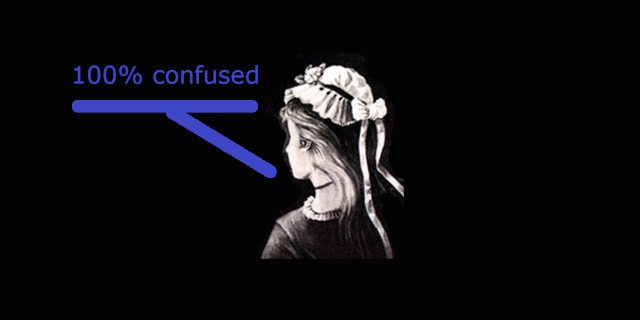

# Learning data science step by step

Most of the examples presented in Internet tutorials are either using powerful libraries (Scikit Learn, Keras...), complex models (neural nets), or based on data samples with many features.

In this collection of workbooks, I want to start from simple examples and raw Python code and then progressively complexify the data sets and use more complex technics and libraries.

On purpose, datasets are generated in order to adjust the parameters fitting with the demonstration.

The notebooks are of type Jupyter, using Python 3.

## Linear regression

Linear regression is the mother of Data Science algorithm.

Let's progressively start from simple univariate example and then add progressively more complexity:
- [Univariate function approximation with linear regression](linear/LinearRegressionUnivariate.html), closed form, with Numpy, Scipy or SciKit Learn, eventually with gradient descent and stochastic gradient descent ([Notebook](linear/LinearRegressionUnivariate.ipynb))
  - [Using Tensor Flow](linear/LinearRegressionUnivariate-TensorFlow.html) ([Notebook](linear/LinearRegressionUnivariate-TensorFlow.ipynb))
- [Bivariate function approximation with linear regression](linear/LinearRegressionBivariate.html), closed formed, using SciKit Learn, (stochastic) gradient descent, adding regularizer ([Notebook](linear/LinearRegressionBivariate.ipynb))
  - [Using Keras](linear/LinearRegressionBivariate-Keras.html), single perceptron linear regression, two layer model ([Notebook](linear/LinearRegressionBivariate-Keras.ipynb))

## Classification

Classification is the other side of the coin in Data Science.

### Binary classification with parametric models

Let's start with the binary classification and logistic regression and add some more refinements:
- [Univariate function as boundary on a two classes data, approximated with logistic regression](classification/ClassificationContinuousSingleFeature.html), homemade, using SciKit Learn ([Notebook](classification/ClassificationContinuousSingleFeature.ipynb))
- [Bivariate parametric function as a boundary, approximated with logistic regression](classification/ClassificationContinuous2Features.html), homemade, using SciKit Learn ([Notebook](classification/ClassificationContinuous2Features.ipynb))
  - [Using Tensor flow](classification/ClassificationContinuous2Features-TensorFlow.html) ([Notebook](classification/ClassificationContinuous2Features-TensorFlow.ipynb))
  - [Using Keras](classification/ClassificationContinuous2Features-Keras.html), adding regularizers and eventually a two layer neural net ([Notebook](classification/ClassificationContinuous2Features-Keras.ipynb))
  
### Binary classification with non-parametric models

Beyond (linear) regression, non-parametric models:
- [Bivariate with K Nearest Neighbors (KNN)](classification/ClassificationContinuous2Features-KNN.html), homemade, using SciKit Learn ([Notebook](classification/ClassificationContinuous2Features-KNN.ipynb))

### Multi-class regression

Going further with more than two classes or categories:
- Two features to separate the 2D plan into 3 or more categories
  - [Using Keras](classification/ClassificationMulti2Features-Keras.html) matching on linearly separable problem (Czech flag) and not linearly separable problem (Norway flag), using 2 and 3 layer neural net to handle the second problem ([Notebook](classification/ClassificationMulti2Features-Keras.ipynb))
  
  
# Reading list

## Nice notebooks

- [Probabilistic programming and Bayesian methods for hackers](https://github.com/CamDavidsonPilon/Probabilistic-Programming-and-Bayesian-Methods-for-Hackers)

## Papers

- [You Look Only Once: Unified, Real-time object detection](https://pjreddie.com/media/files/papers/yolo_1.pdf)
  - [YOLO in Keras - Machine Learning Mastery](https://machinelearningmastery.com/how-to-perform-object-detection-with-yolov3-in-keras/)
- [Learning to forget, continual prediction with LSTM - F. A. Gers et al.](http://citeseerx.ist.psu.edu/viewdoc/download?doi=10.1.1.55.5709&rep=rep1&type=pdf)
- [What are biases in my word embeddings ? - N. Swinger et al.](https://arxiv.org/pdf/1812.08769.pdf)
  
  
## Tutorials

- [Deep learning tutorial - Stanford](http://ufldl.stanford.edu/tutorial/)

## Articles

- Build the right autoencoder — Tune and Optimize using PCA principles - Medium [Part I](https://medium.com/@cran2367/build-the-right-autoencoder-tune-and-optimize-using-pca-principles-part-i-1f01f821999b), [Part II](https://medium.com/@cran2367/build-the-right-autoencoder-tune-and-optimize-using-pca-principles-part-ii-24b9cca69bd6)

## Data / model sources

### Word embeddings & analysis

- [ConceptNet](http://www.conceptnet.io/)
- [GloVe: Global Vectors for Word Representation - Stanford](https://nlp.stanford.edu/projects/glove/)
- [Opinion Mining, Sentiment Analysis, and Opinion Spam Detection](https://www.cs.uic.edu/~liub/FBS/sentiment-analysis.html)

## Books

- Deep Learning - I. Goodfellow, Y. Bengio, A. Courville, The MIT Press. Very overview of machine learning and its extension to deep learning
- An Introduction to Statistical Learning with Applications in R - G. James, D. Witten, T. Hastie, R. Tibshirani. Traditional machine learning including regressions, clustering, SVM...